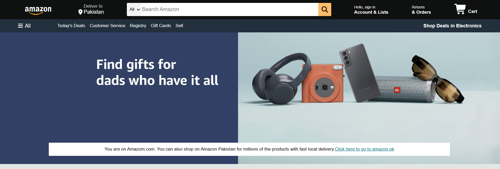
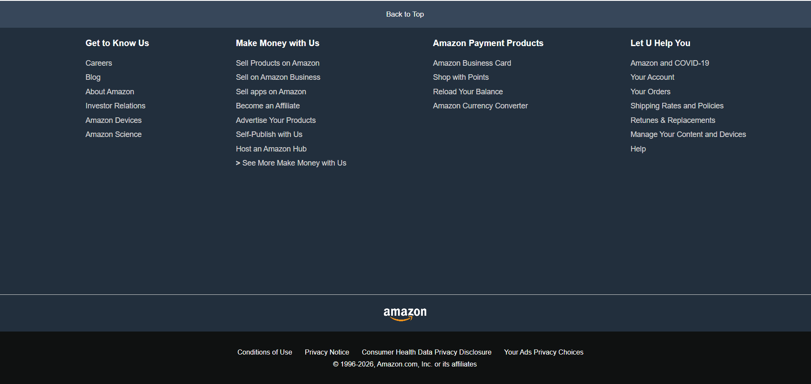

# Amazon Homepage Clone

## Overview

This project is a front-end clone of the Amazon homepage developed using HTML and CSS. It was created to strengthen my understanding of webpage layout, responsive design, and modern CSS techniques by recreating the interface of a well-known e-commerce website.

> **Note:** This project is intended for educational purposes only. It is not affiliated with or endorsed by Amazon.

---

## Features

- Responsive homepage layout
- Navigation bar
- Search bar
- Product category cards
- Promotional banners
- Footer with multiple sections
- Clean and organized CSS styling

---

## Technologies Used

- HTML5
- CSS3
- Vercel

---

---

## Screenshots

### Homepage



### Product Section


### HomePage Bottom


---

## How to Run

1. Clone the repository.

```bash
git clone https://github.com/yourusername/amazon-clone.git
```

2. Open the project folder.

3. Double-click `index.html`

or

Open it using **VS Code** and launch it with **Live Server**.

---

## What I Learned

Through this project, I improved my understanding of:

- HTML page structure
- CSS Flexbox
- CSS Grid
- Responsive web design
- Positioning and alignment
- Recreating real-world user interfaces
- Organizing front-end code

---

## Future Improvements

- Add JavaScript functionality
- Implement a shopping cart
- Create individual product pages
- Add user authentication
- Connect to a backend database
- Improve mobile responsiveness

---

## Author

**Tayyaba Riaz**

Computer Science Undergraduate

GitHub: https://github.com/T-R-Malik
